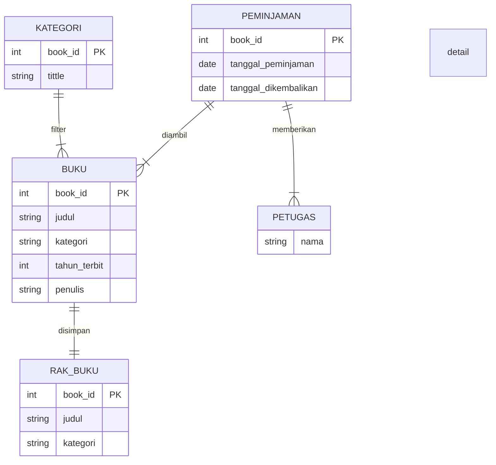
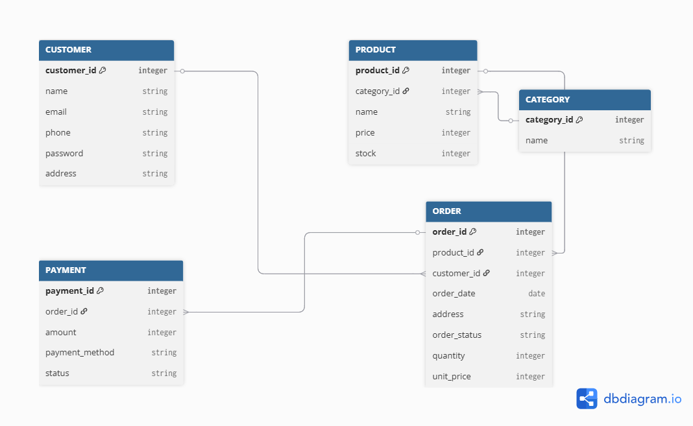

```
Table CUSTOMER{
  customer_id integer [primary key]
  name string
  email string
  phone string
  password string
  address string
}

Table PRODUCT{
  product_id integer [primary key]
  category_id integer
  name string
  price integer
  stock integer
}

Table ORDER{
  order_id integer [primary key]
  product_id integer
  customer_id integer
  order_date date
  address string
  order_status string
  quantity integer
  unit_price integer

}

Table CATEGORY{
  category_id integer [primary key]
  name string
}

Table PAYMENT{
  payment_id integer [primary key]
  order_id integer
  amount integer 
  payment_method string
  status string
}

Ref: CATEGORY.category_id < PRODUCT.category_id

Ref: CUSTOMER.customer_id < ORDER.customer_id

Ref: PRODUCT.product_id < ORDER.product_id

Ref: ORDER.order_id < PAYMENT.order_id

```
